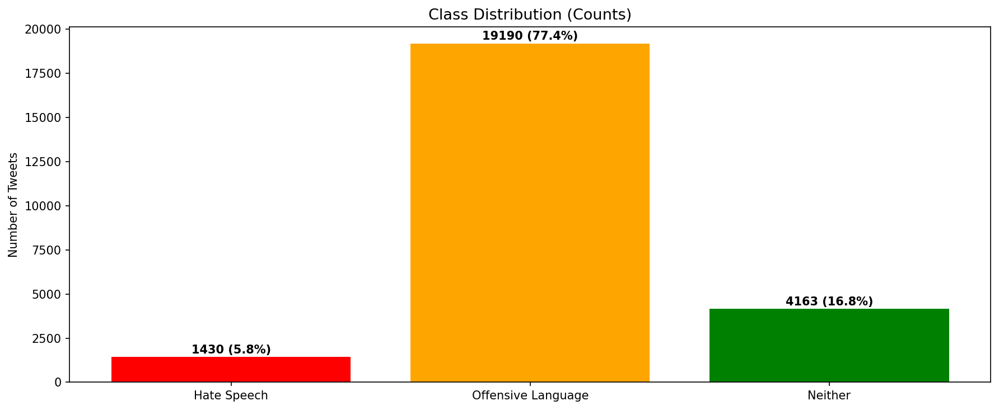
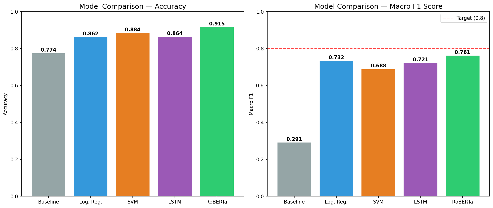
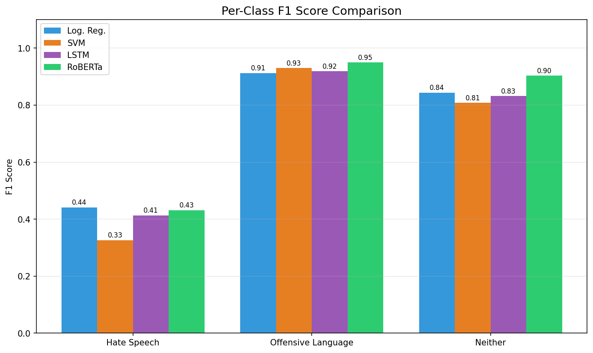

# Hate Speech Detection: a comparative study of machine learning approaches

Multiclass classification of tweets into **hate speech**, **offensive language**, or **neither**,
on the Davidson et al. (2017) dataset. Two traditional models (Logistic Regression and a linear
SVM on TF-IDF features) are compared against two deep learning models (a bidirectional LSTM and a
fine-tuned RoBERTa transformer).

MSc coursework, Applied and Understanding AI module, University of Hull.

---

## The problem

Manual moderation does not scale to the volume of social media, so automated detection matters.
The hard part is not spotting rude words. It is separating genuine hate speech, which targets a
group, from ordinary offensive language that shares much of the same vocabulary. That overlap is
what makes the task difficult, and it is the distinction this project measures.

---

## Data

The Davidson et al. (2017) Hate Speech and Offensive Language dataset: about 24,800 tweets, each
labelled by CrowdFlower annotators as hate speech (class 0), offensive language (class 1), or
neither (class 2). The classes are heavily imbalanced: roughly 77% offensive, 17% neither, and
only 6% hate speech. The data is not committed here. See [`data/README.md`](data/README.md) for
how to obtain it.



---

## Method

**Preprocessing.** Links, mentions, retweet markers and punctuation are removed, text is
lowercased and lemmatised, and stopwords are dropped for the traditional models. The data is
split 80/20 with stratified sampling, and the class imbalance is addressed with random
oversampling of the training set.

**Features and models.**

- **Logistic Regression** and **linear SVM** on TF-IDF features (unigrams and bigrams, 10,000
  features), tuned with 5-fold stratified `GridSearchCV`.
- **Bidirectional LSTM** in PyTorch: a 128-dim embedding, two bi-LSTM layers of 128 units,
  dropout, and a feed-forward head, trained with early stopping on validation macro F1.
- **RoBERTa** (`roberta-base`) fine-tuned for the three classes with the AdamW optimiser and a
  2e-5 learning rate.

Macro F1 is the primary metric, chosen so the tiny hate-speech class is not drowned out by
accuracy; accuracy is reported as a secondary metric.

---

## Results

| Model | Macro F1 | Accuracy |
|---|---|---|
| RoBERTa | **0.76** | 0.90 |
| Logistic Regression | 0.72 | 0.88 |
| SVM | 0.67 | 0.88 |
| LSTM | 0.63 | 0.84 |



RoBERTa wins on both metrics, because context is what separates hate speech from offensive
language and a pre-trained transformer captures it best. Logistic Regression beats the LSTM: the
dataset is small and imbalanced, so the LSTM overfits, which its training curves show clearly.
Across every model the recurring error is hate speech being read as offensive language, and hate
speech stays the hardest class throughout.



---

## Repository structure

```
msc-nlp-hate-speech-classification/
  notebooks/
    hate_speech_classification.ipynb   EDA, preprocessing, the four models, and the comparison
  src/
    preprocessing.py   tweet cleaning, vocabulary building, sequence encoding
    lstm.py            the bidirectional LSTM classifier and its dataset wrapper
  reports/figures/   figures used above
  data/              provenance and licensing (dataset not committed)
  requirements.txt
```

The notebook holds the full analysis end to end. `src/` collects the reusable preprocessing and
model code as importable modules.

---

## Running it

```bash
python -m venv .venv && source .venv/bin/activate   # Windows: .venv\Scripts\activate
pip install -r requirements.txt
```

Put `labeled_data.csv` in `data/raw/` (see `data/README.md`), then run
`notebooks/hate_speech_classification.ipynb`. RoBERTa fine-tuning and LSTM training are much
faster on a GPU.

---

## Tools

Python, scikit-learn, PyTorch, Hugging Face Transformers, NLTK, pandas, NumPy, Matplotlib,
seaborn, wordcloud.
